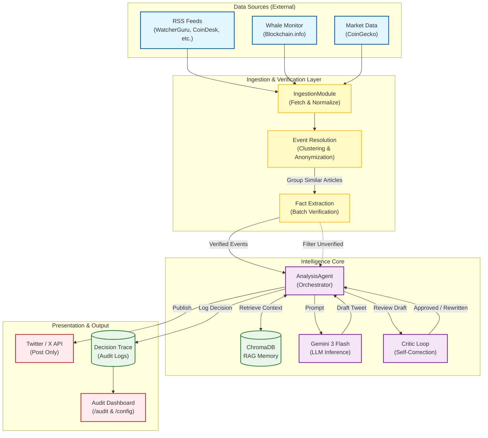

# System Overview Diagram

This document contains the high-level architecture diagram for the Sentix system (v2.1).
It is written in **Mermaid.js**, which renders automatically in GitHub.

## Diagram Explanation

1.  **Data Sources**: The system pulls raw data from RSS feeds, on-chain whale alerts, and market price APIs.
2.  **Ingestion & Verification**:
    *   **Event Resolution**: Groups related articles to identify unique real-world events.
    *   **Fact Extraction**: Verifies facts by ensuring multiple sources report the same information.
3.  **Intelligence Core**:
    *   **Gemini 3 Flash**: The primary LLM used for analyzing sentiment and generating content.
    *   **RAG Memory**: Retrieves historical context (e.g., "How did BTC react to similar CPI data last time?").
    *   **Critic Loop**: A secondary AI check to prevent hallucinations before posting.
4.  **Output**:
    *   **Twitter**: Final posts are sent to X.
    *   **Audit Dashboard**: Every step is logged for transparency, allowing users to trace the AI's decision-making process.
