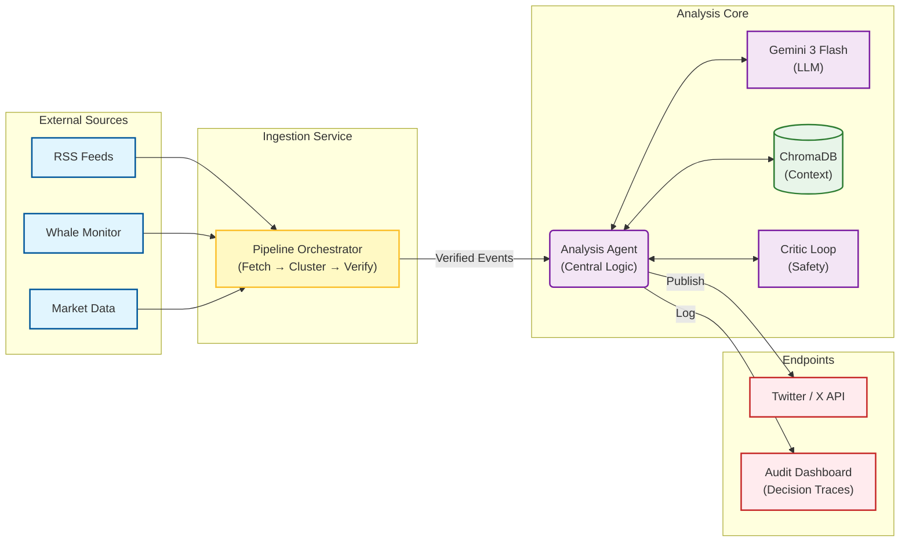

# Simplified System Architecture

This document provides a high-level developer overview of the Sentix system (v2.1).
For the detailed component interaction view, see [SYSTEM_DIAGRAM.md](./SYSTEM_DIAGRAM.md).

## Diagram Explanation

*   **Ingestion Service**: Consolidates raw data fetching, event resolution (clustering), and fact verification into a single automated pipeline. Only verified, high-confidence events are passed downstream.
*   **Analysis Core**: The **Analysis Agent** acts as the central brain. It queries **ChromaDB** for historical context, sends prompts to **Gemini** for reasoning, and runs a **Critic Loop** to self-correct before finalizing content.
*   **Endpoints**: The system has two distinct outputs:
    1.  **Public**: Posts to Twitter/X.
    2.  **Internal**: Logs comprehensive decision traces to the Audit Dashboard for transparency.
